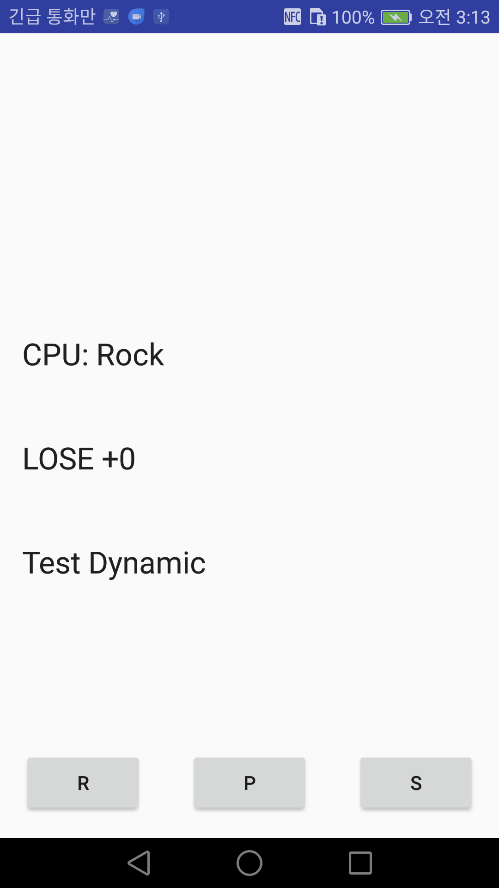
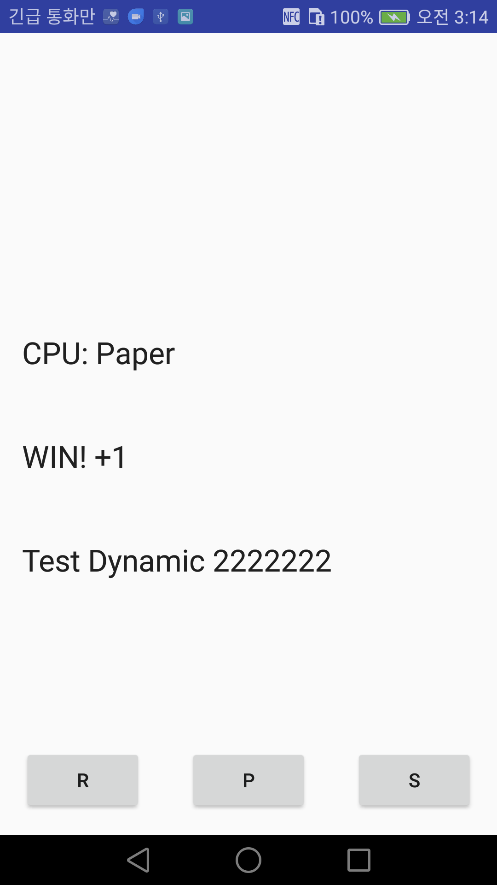

# Tracing smali
```
09-01 01:39:09.773   599   599 I JunoLogCatWWWW: Lcom/example/seccon2015/rock_paper_scissors/MainActivity ->
09-01 01:39:09.776   599   599 I JunoLogCatWWWW: Lcom/example/seccon2015/rock_paper_scissors/MainActivity -> constructor <init>()V
09-01 01:39:09.777   599   599 I JunoLogCatWWWW: Lcom/example/seccon2015/rock_paper_scissors/MainActivity$1 ->
09-01 01:39:09.781   599   599 I JunoLogCatWWWW: Lcom/example/seccon2015/rock_paper_scissors/MainActivity -> onCreate(Landroid/os/Bundle;)V
09-01 01:39:12.974   599   599 I JunoLogCatWWWW: Lcom/example/seccon2015/rock_paper_scissors/MainActivity -> onClick(Landroid/view/View;)V
09-01 01:39:13.976   599   599 I JunoLogCatWWWW: Lcom/example/seccon2015/rock_paper_scissors/MainActivity$1 -> run()V
09-01 01:39:14.611   599   599 I JunoLogCatWWWW: Lcom/example/seccon2015/rock_paper_scissors/MainActivity -> onClick(Landroid/view/View;)V
09-01 01:39:14.768   599   599 I JunoLogCatWWWW: Lcom/example/seccon2015/rock_paper_scissors/MainActivity -> onClick(Landroid/view/View;)V
09-01 01:39:15.612   599   599 I JunoLogCatWWWW: Lcom/example/seccon2015/rock_paper_scissors/MainActivity$1 -> run()V
09-01 01:39:17.062   599   599 I JunoLogCatWWWW: Lcom/example/seccon2015/rock_paper_scissors/MainActivity -> onClick(Landroid/view/View;)V
09-01 01:39:18.064   599   599 I JunoLogCatWWWW: Lcom/example/seccon2015/rock_paper_scissors/MainActivity$1 -> run()V
09-01 01:39:18.244   599   599 I JunoLogCatWWWW: Lcom/example/seccon2015/rock_paper_scissors/MainActivity -> onClick(Landroid/view/View;)V
09-01 01:39:19.245   599   599 I JunoLogCatWWWW: Lcom/example/seccon2015/rock_paper_scissors/MainActivity$1 -> run()V
09-01 01:39:19.424   599   599 I JunoLogCatWWWW: Lcom/example/seccon2015/rock_paper_scissors/MainActivity -> onClick(Landroid/view/View;)V
09-01 01:39:19.998   599   599 I JunoLogCatWWWW: Lcom/example/seccon2015/rock_paper_scissors/MainActivity -> onClick(Landroid/view/View;)V
09-01 01:39:20.338   599   599 I JunoLogCatWWWW: Lcom/example/seccon2015/rock_paper_scissors/MainActivity -> onClick(Landroid/view/View;)V
09-01 01:39:20.425   599   599 I JunoLogCatWWWW: Lcom/example/seccon2015/rock_paper_scissors/MainActivity$1 -> run()V
09-01 01:39:20.729   599   599 I JunoLogCatWWWW: Lcom/example/seccon2015/rock_paper_scissors/MainActivity -> onClick(Landroid/view/View;)V
09-01 01:39:21.730   599   599 I JunoLogCatWWWW: Lcom/example/seccon2015/rock_paper_scissors/MainActivity$1 -> run()V
09-01 01:39:23.331   599   599 I JunoLogCatWWWW: Lcom/example/seccon2015/rock_paper_scissors/MainActivity -> onClick(Landroid/view/View;)V
09-01 01:39:24.332   599   599 I JunoLogCatWWWW: Lcom/example/seccon2015/rock_paper_scissors/MainActivity$1 -> run()V
09-01 01:39:25.304   599   599 I JunoLogCatWWWW: Lcom/example/seccon2015/rock_paper_scissors/MainActivity -> onClick(Landroid/view/View;)V
09-01 01:39:26.305   599   599 I JunoLogCatWWWW: Lcom/example/seccon2015/rock_paper_scissors/MainActivity$1 -> run()V
09-01 01:39:27.396   599   599 I JunoLogCatWWWW: Lcom/example/seccon2015/rock_paper_scissors/MainActivity -> onClick(Landroid/view/View;)V
09-01 01:39:28.397   599   599 I JunoLogCatWWWW: Lcom/example/seccon2015/rock_paper_scissors/MainActivity$1 -> run()V
```

# Dynamic file read and change variable




